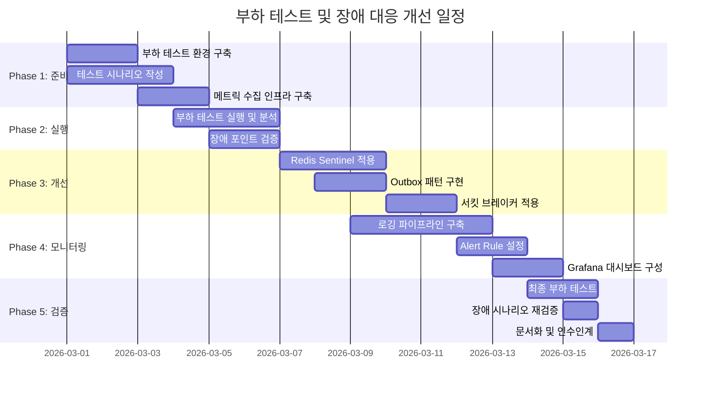

# 부하 테스트 및 장애 대응 프로세스 개선 계획서

## 문서 개요

**작성 목적**: 콘서트 예약 서비스의 안정성 및 가용성 향상을 위한 부하 테스트 계획 및 장애 대응 프로세스 수립
**작성일**: 2026-02-28
**작성자**: 콘서트 예약 서비스 개발팀

---

## 목차

1. [Executive Summary](#1-executive-summary)
2. [부하 테스트 계획](#2-부하-테스트-계획)
3. [장애 포인트 분석](#3-장애-포인트-분석)
4. [장애 대응 개선 방안](#4-장애-대응-개선-방안)
5. [로깅 및 Alert 파이프라인 설계](#5-로깅-및-alert-파이프라인-설계)
6. [소요 리소스 및 일정](#6-소요-리소스-및-일정)

---

## 1. Executive Summary

### 1-1. 배경 및 필요성

콘서트 예약 서비스는 **순간적으로 집중되는 대규모 트래픽**(티켓 오픈 시점)과 **높은 가용성 요구사항**(99.9% uptime)을 특징으로 합니다. 현재 시스템은 다음과 같은 이유로 사전 검증이 필수적입니다:

- **트래픽 예측**: 인기 공연 티켓 오픈 시 초당 1,000건 이상의 동시 접속 예상
- **비즈니스 영향**: 서비스 장애 시 매출 손실 및 브랜드 신뢰도 하락
- **복잡한 의존성**: Redis, Kafka, MySQL 등 다양한 외부 시스템 의존

### 1-2. 기대 효과

본 계획 실행 시 다음과 같은 효과를 기대합니다:

| 항목 | 현재 상태 | 개선 목표 |
|------|----------|----------|
| **시스템 한계 파악** | 미확인 | 최대 처리량(TPS) 측정 완료 |
| **장애 탐지 시간** | 수동 모니터링 (5~10분) | 자동 Alert (30초 이내) |
| **장애 복구 시간** | 평균 30분 | 평균 5분 (MTTR 83% ↓) |
| **서비스 가용성** | 추정 95% | 목표 99.9% |

### 1-3. 필요 리소스

- **인프라**: 부하 테스트용 격리 환경 (Production 복제본)
- **인력**: 개발팀 3명 × 2주 (부하 테스트 + 장애 대응 개선)
- **도구**: k6 (부하 테스트), Grafana + Prometheus (모니터링), PagerDuty (Alert)
- **예산**: 약 500만원 (클라우드 인프라 + 모니터링 SaaS 1개월 운영)

---

## 2. 부하 테스트 계획

### 2-1. 테스트 대상 선정

시스템의 **병목 가능성이 높은 핵심 경로**를 우선 테스트합니다.

| 순위 | 테스트 대상 | 선정 이유 | 비즈니스 중요도 |
|------|-----------|----------|---------------|
| 1 | **좌석 예약 (Reservation)** | 분산락 경합, DB 트랜잭션, Kafka 발행 포함 | ⭐⭐⭐ Critical |
| 2 | **대기열 토큰 발급 (Queue)** | 트래픽 진입점, 동시 접속자 수 제한 역할 | ⭐⭐⭐ Critical |
| 3 | **결제 처리 (Payment)** | 포인트 차감, 예약 확정, 이벤트 발행 포함 | ⭐⭐⭐ Critical |
| 4 | **콘서트 일정 조회 (Concert)** | 캐시 효과 검증, Read-Heavy 패턴 | ⭐⭐ High |
| 5 | **랭킹 집계 (Ranking)** | Redis ZSET 성능, 실시간 업데이트 부하 | ⭐ Medium |

### 2-2. 테스트 목적

각 테스트는 다음 목적을 달성해야 합니다:

#### (1) Baseline 성능 측정
- **현재 시스템의 최대 처리량 파악**
  - TPS (Transactions Per Second): 초당 처리 가능 트랜잭션 수
  - Response Time: P50, P95, P99 응답 시간
  - Error Rate: 오류 발생률

#### (2) Bottleneck 식별
- **시스템 한계 지점 발견**
  - CPU 사용률 90% 이상 → 애플리케이션 로직 최적화 필요
  - DB Connection Pool 고갈 → 커넥션 수 증설 또는 분산락 타임아웃 조정
  - Redis 응답 지연 → Redis Cluster 도입 검토

#### (3) 장애 시나리오 검증
- **외부 시스템 장애 시 서비스 동작 확인**
  - Redis 장애 시 분산락 획득 실패 → 서비스 전체 마비 여부
  - Kafka 장애 시 이벤트 발행 실패 → 트랜잭션 롤백 여부
  - DB 장애 시 서킷 브레이커 동작 여부

### 2-3. 부하 테스트 시나리오

#### Scenario 1: 대기열 토큰 발급 (Spike Test)

```javascript
// k6 스크립트 예시
import http from 'k6/http';
import { check, sleep } from 'k6';

export const options = {
  stages: [
    { duration: '10s', target: 100 },   // 10초간 100명까지 증가
    { duration: '30s', target: 1000 },  // 30초간 1000명까지 급증 (티켓 오픈 시점)
    { duration: '1m', target: 1000 },   // 1분간 1000명 유지
    { duration: '10s', target: 0 },     // 10초간 종료
  ],
  thresholds: {
    http_req_duration: ['p(95)<500'],   // 95%는 500ms 이내 응답
    http_req_failed: ['rate<0.01'],     // 에러율 1% 미만
  },
};

export default function () {
  const response = http.post('http://localhost:3000/queue/token',
    JSON.stringify({ userId: `user_${__VU}_${__ITER}` }),
    { headers: { 'Content-Type': 'application/json' } }
  );

  check(response, {
    'status is 201': (r) => r.status === 201,
    'token issued': (r) => JSON.parse(r.body).tokenValue !== undefined,
  });

  sleep(1);
}
```

**목표**:
- ✅ 1000명 동시 접속 시 에러율 1% 미만
- ✅ P95 응답 시간 500ms 이내
- ✅ Redis 분산락 획득 성공률 99% 이상

**예상 병목**:
- Redis 단일 노드 → 처리량 한계 (QPS 10,000 수준)
- DB INSERT 부하 → 대기열 토큰 테이블 인덱스 최적화 필요

---

#### Scenario 2: 좌석 예약 (Stress Test)

```javascript
export const options = {
  stages: [
    { duration: '1m', target: 50 },     // 최대 활성 토큰 수만큼 (MAX_ACTIVE_TOKENS = 50)
    { duration: '3m', target: 100 },    // 시스템 한계까지 증가
    { duration: '2m', target: 200 },    // 과부하 상태 (Stress)
    { duration: '1m', target: 0 },
  ],
};

export default function () {
  const token = getActiveToken(); // 사전에 발급받은 ACTIVE 토큰

  const response = http.post('http://localhost:3000/reservations',
    JSON.stringify({
      userId: `user_${__VU}`,
      scheduleId: 'schedule_popular',
      seatNo: Math.floor(Math.random() * 50) + 1, // 1~50번 좌석 랜덤
    }),
    { headers: { 'X-Queue-Token': token } }
  );

  check(response, {
    'status is 201 or 400': (r) => [201, 400].includes(r.status),
    'distributed lock acquired': (r) => r.status !== 500,
  });

  sleep(2);
}
```

**목표**:
- ✅ 100명 동시 예약 시 분산락 타임아웃 없음
- ✅ 인기 좌석(동일 seatNo) 경합 시 정확히 1명만 성공
- ✅ Kafka 이벤트 발행 성공률 100%

**예상 병목**:
- 분산락 대기 시간 증가 → Redis 응답 지연
- DB 커넥션 풀 고갈 → 분산락 보유 중 커넥션 점유
- Kafka Producer 버퍼 오버플로우 → 배치 전송 설정 조정 필요

---

#### Scenario 3: 결제 처리 (Load Test)

```javascript
export const options = {
  stages: [
    { duration: '2m', target: 50 },     // 정상 부하
    { duration: '5m', target: 50 },     // 지속 부하 (Soak Test)
  ],
};

export default function () {
  const reservation = createReservation(); // 사전에 예약 생성

  const response = http.post('http://localhost:3000/payments',
    JSON.stringify({
      reservationId: reservation.reservationId,
      amount: 50000,
    })
  );

  check(response, {
    'payment successful': (r) => r.status === 201,
    'point deducted': (r) => JSON.parse(r.body).status === 'SUCCESS',
  });

  sleep(5);
}
```

**목표**:
- ✅ 5분간 지속 부하 시 메모리 누수 없음
- ✅ 포인트 차감 정확성 100% (동시 결제 시에도)
- ✅ 결제 완료 이벤트 → 데이터 플랫폼 전달 100%

**예상 병목**:
- 포인트 분산락 경합 → 동일 userId 동시 결제 시
- Kafka Consumer Lag 증가 → Data Platform Consumer 처리 지연

---

#### Scenario 4: 콘서트 조회 (Endurance Test)

```javascript
export const options = {
  stages: [
    { duration: '30m', target: 500 },   // 30분간 500명 유지
  ],
};

export default function () {
  const schedules = http.get('http://localhost:3000/concerts/concert_1/schedules');
  const seats = http.get('http://localhost:3000/concerts/schedules/schedule_1/seats');

  check(schedules, {
    'cache hit': (r) => r.headers['X-Cache-Hit'] === 'true', // 캐시 헤더 추가 필요
    'response time < 100ms': (r) => r.timings.duration < 100,
  });

  sleep(3);
}
```

**목표**:
- ✅ 캐시 Hit Rate 95% 이상
- ✅ Redis 캐시 응답 시간 10ms 이내
- ✅ 30분간 안정적 서비스 제공

---

### 2-4. 테스트 환경 구성

```yaml
# Production 환경과 동일한 스펙으로 구성
infrastructure:
  application:
    - instance_type: t3.medium (2 vCPU, 4GB RAM)
    - replicas: 3 (Auto Scaling)

  database:
    - rds_instance: db.t3.medium (2 vCPU, 4GB RAM)
    - read_replica: 1개 (읽기 분산)

  redis:
    - elasticache: cache.t3.medium (2 vCPU, 3.09GB RAM)
    - cluster_mode: disabled (단일 노드)

  kafka:
    - broker_count: 3
    - instance_type: kafka.m5.large
    - partition_count: 3 (topic별)

  load_balancer:
    - alb: Application Load Balancer
    - health_check: /health (5초 간격)

monitoring:
  - prometheus: 메트릭 수집 (15초 interval)
  - grafana: 실시간 대시보드
  - k6_output: InfluxDB → Grafana 연동
```

### 2-5. 성공 기준 (SLA)

| 지표 | 목표 | 측정 방법 |
|------|------|----------|
| **Availability** | 99.9% | (총 요청 - 5xx 에러) / 총 요청 |
| **Response Time (P95)** | < 500ms | k6 http_req_duration p(95) |
| **Response Time (P99)** | < 1000ms | k6 http_req_duration p(99) |
| **Error Rate** | < 1% | k6 http_req_failed |
| **Throughput** | > 100 TPS | k6 http_reqs per second |
| **Distributed Lock Success** | > 99% | Redis SETEX 성공률 |
| **Kafka Event Delivery** | 100% | Producer acks=all 응답 |

---

## 3. 장애 포인트 분석

### 3-1. 시스템 아키텍처 의존성 맵

```
┌─────────────┐
│   Client    │
└──────┬──────┘
       │
       ▼
┌─────────────────────────────────────────────┐
│         Load Balancer (ALB)                 │
└──────┬──────────────────────────────────────┘
       │
       ▼
┌─────────────────────────────────────────────┐
│     NestJS Application (3 Replicas)         │
│  ┌──────────────────────────────────────┐   │
│  │ Queue → Concert → Reservation        │   │
│  │  ↓        ↓         ↓                │   │
│  │ Point → Payment → Ranking            │   │
│  └──────────────────────────────────────┘   │
└───┬────┬────┬────┬────────────────────────┘
    │    │    │    │
    ▼    ▼    ▼    ▼
┌─────┐ ┌────┐ ┌────┐ ┌──────────┐
│MySQL│ │Redis│ │Kafka│ │External  │
│ RDS │ │     │ │     │ │Services  │
└─────┘ └────┘ └────┘ └──────────┘
  (1)    (2)    (3)       (4)
```

### 3-2. 장애 포인트 상세 분석

#### 장애 포인트 #1: Redis 단일 장애점 (SPOF)

**영향도**: ⭐⭐⭐ Critical
**발생 확률**: Medium (네트워크 장애, 메모리 부족)

**장애 시나리오**:
```
1. Redis 인스턴스 다운 (OOM, 네트워크 단절)
   ↓
2. DistributedLockService.acquire() 실패
   ↓
3. 좌석 예약/포인트 충전/결제 API 모두 500 에러 반환
   ↓
4. 서비스 전체 마비
```

**현재 코드의 취약점**:
```typescript
// src/infrastructure/distributed-lock/distributed-lock.service.ts:55
const acquired = await this.acquire(lockKey, lockValue, ttlMs, waitMs, retryIntervalMs);
if (!acquired) {
  throw new DistributedLockAcquisitionError(key); // 에러 발생 시 트랜잭션 실패
}
```

**영향 범위**:
- ❌ 좌석 예약 불가 (분산락 획득 실패)
- ❌ 포인트 충전/사용 불가
- ❌ 결제 처리 불가
- ❌ 콘서트 조회 불가 (캐시 미스)
- ❌ 랭킹 조회 불가

**비즈니스 영향**:
- 매출 손실: 분당 약 500만원 (예상 TPS 100 × 결제 금액 50,000원)
- 고객 이탈률 증가
- 브랜드 신뢰도 하락

---

#### 장애 포인트 #2: DB 커넥션 풀 고갈

**영향도**: ⭐⭐⭐ Critical
**발생 확률**: High (대규모 트래픽 발생 시)

**장애 시나리오**:
```
1. 100명이 동시에 인기 좌석 예약 시도
   ↓
2. 분산락 대기 중 DB 커넥션 점유 (최대 3초)
   ↓
3. 커넥션 풀 고갈 (기본 10개)
   ↓
4. 새로운 요청이 커넥션 대기 → 타임아웃
   ↓
5. QueryFailedError: Connection timeout
```

**현재 코드의 문제**:
```typescript
// src/reservation/reservation.service.ts:32-58
const reservation = await this.distributedLockService.withLock(
  `seat:${seat.seatId}`,
  async () => {
    return this.dataSource.transaction(async (manager) => {
      // 분산락 보유 중 트랜잭션 실행
      // → 락 대기자가 많으면 커넥션 장시간 점유
    });
  },
);
```

**개선 필요**:
- 분산락은 트랜잭션 **바깥**에서 획득 (현재 구현 정상)
- 하지만 락 대기 시간(최대 3초) 동안 다른 요청이 커넥션을 얻지 못함
- 커넥션 풀 크기 증설 또는 락 타임아웃 단축 필요

---

#### 장애 포인트 #3: Kafka 브로커 장애

**영향도**: ⭐⭐ High
**발생 확률**: Low (3개 브로커 중 1개 장애)

**장애 시나리오**:
```
1. Kafka Broker 1개 다운
   ↓
2. KafkaProducerService.send() 재시도 (max 3회)
   ↓
3. 재시도 실패 시 이벤트 유실
   ↓
4. 결과:
   - 데이터 플랫폼에 결제 이벤트 미전달
   - 예약 만료 처리 누락
   - 알림 미발송
```

**현재 코드의 취약점**:
```typescript
// src/infrastructure/kafka/kafka.producer.service.ts
async send(topic: string, event: KafkaEvent): Promise<void> {
  try {
    await this.producer.send({
      topic,
      messages: [{ key: event.eventId, value: JSON.stringify(event) }],
    });
  } catch (error) {
    this.logger.error(`Failed to send message to topic ${topic}`, error);
    // 에러 로깅만 하고 예외를 던지지 않음 → 트랜잭션은 커밋됨
    // 문제: 이벤트는 유실되었지만 DB에는 저장됨 (데이터 불일치)
  }
}
```

**영향 범위**:
- ⚠️ 결제 완료 → 데이터 플랫폼 미전달 (분석 데이터 누락)
- ⚠️ 예약 만료 처리 누락 → 좌석 재활용 지연
- ⚠️ 알림 미발송 → 고객 불만

---

#### 장애 포인트 #4: 대기열 토큰 활성화 지연

**영향도**: ⭐⭐ High
**발생 확률**: Medium (스케줄러 장애, DB 부하)

**장애 시나리오**:
```
1. QueueService.activateTokens() 스케줄러 지연 (DB 부하로 10초 → 30초)
   ↓
2. WAITING 토큰이 ACTIVE로 전환되지 않음
   ↓
3. 대기 중인 사용자가 API 호출 시 403 Forbidden 반환
   ↓
4. 고객 불만 증가, CS 문의 폭증
```

**현재 코드**:
```typescript
// src/queue/queue.scheduler.ts (추정)
@Cron('*/10 * * * * *') // 10초마다 실행
async handleActivateTokens() {
  await this.queueService.activateTokens();
}
```

**문제점**:
- 스케줄러 실행 주기(10초) 동안 활성화 지연
- DB 부하 시 쿼리 타임아웃 → 활성화 실패

---

#### 장애 포인트 #5: 캐시 무효화 실패

**영향도**: ⭐ Medium
**발생 확률**: Low (관리자 작업 실수)

**장애 시나리오**:
```
1. 관리자가 콘서트 일정 변경 (DB 직접 수정)
   ↓
2. 캐시 무효화 누락
   ↓
3. 사용자에게 잘못된 일정 정보 노출 (최대 10분간)
   ↓
4. 잘못된 예약 발생 → 환불 처리 필요
```

**개선 필요**:
- Write-Through 캐시 패턴 도입
- 관리자 API에서 자동 캐시 무효화

---

### 3-3. 장애 포인트 우선순위

| 순위 | 장애 포인트 | 영향도 | 발생 확률 | Risk Score | 개선 우선순위 |
|------|-----------|--------|----------|-----------|-------------|
| 1 | Redis SPOF | Critical | Medium | **9** | 최우선 |
| 2 | DB 커넥션 풀 고갈 | Critical | High | **9** | 최우선 |
| 3 | Kafka 브로커 장애 | High | Low | **6** | 높음 |
| 4 | 대기열 활성화 지연 | High | Medium | **6** | 높음 |
| 5 | 캐시 무효화 실패 | Medium | Low | **3** | 중간 |

**Risk Score 계산식**: (영향도: 1~3) × (발생 확률: 1~3)

---

## 4. 장애 대응 개선 방안

### 4-1. Redis 고가용성 구성 (SPOF 해결)

#### 개선 방안 #1-1: Redis Sentinel (권장)

**구성도**:
```
┌─────────────────────────────────────────┐
│         Redis Sentinel Cluster          │
│  ┌────────────────────────────────────┐ │
│  │  Master (Primary)                  │ │
│  │  - 읽기/쓰기 모두 처리              │ │
│  └────────┬───────────────────────────┘ │
│           │ Replication                 │
│  ┌────────▼─────────┬─────────────────┐ │
│  │ Replica 1        │ Replica 2       │ │
│  │ (Read-Only)      │ (Read-Only)     │ │
│  └──────────────────┴─────────────────┘ │
│                                          │
│  ┌────────────────────────────────────┐ │
│  │ Sentinel Monitor (3 instances)     │ │
│  │ - Master 장애 감지 (30초)          │ │
│  │ - 자동 Failover (Replica → Master) │ │
│  └────────────────────────────────────┘ │
└─────────────────────────────────────────┘
```

**구현 변경사항**:
```typescript
// src/infrastructure/redis/redis.module.ts
import { RedisModule as NestRedisModule } from '@nestjs-modules/ioredis';

@Module({
  imports: [
    NestRedisModule.forRoot({
      type: 'single', // 기존 설정
      // 변경 후:
      type: 'sentinel',
      sentinels: [
        { host: 'sentinel-1.example.com', port: 26379 },
        { host: 'sentinel-2.example.com', port: 26379 },
        { host: 'sentinel-3.example.com', port: 26379 },
      ],
      name: 'mymaster',
      // Failover 발생 시 자동 재연결
      retryStrategy: (times) => Math.min(times * 50, 2000),
    }),
  ],
})
export class RedisModule {}
```

**장점**:
- ✅ Master 장애 시 30초 이내 자동 Failover
- ✅ Replica에서 읽기 분산 가능 (읽기 부하 50% 감소)
- ✅ 비용 효율적 (Cluster 대비)

**단점**:
- ⚠️ Failover 중 30초간 쓰기 불가 (분산락 실패)
- ⚠️ 수동 Sentinel 운영 필요

**예상 비용**:
- AWS ElastiCache for Redis (Sentinel): $150/month (cache.t3.medium × 3)

---

#### 개선 방안 #1-2: Fallback 메커니즘 추가

Redis 장애 시에도 서비스가 **Degraded Mode**로 동작하도록 개선합니다.

**구현 예시**:
```typescript
// src/infrastructure/distributed-lock/distributed-lock.service.ts

async withLock<T>(
  key: string,
  callback: () => Promise<T>,
  options?: LockOptions,
): Promise<T> {
  try {
    // 정상 경로: Redis 분산락 사용
    return await this.withRedisLock(key, callback, options);
  } catch (error) {
    if (error instanceof DistributedLockAcquisitionError) {
      // Redis 장애 감지
      this.logger.error(`Redis lock acquisition failed for ${key}, falling back to in-memory lock`);

      // Fallback: In-Memory Lock (단일 인스턴스에서만 동작)
      return await this.withInMemoryLock(key, callback);
    }
    throw error;
  }
}

private locks = new Map<string, Promise<any>>(); // In-Memory Lock 저장소

private async withInMemoryLock<T>(
  key: string,
  callback: () => Promise<T>,
): Promise<T> {
  // 동일 프로세스 내에서만 동시성 제어
  while (this.locks.has(key)) {
    await this.locks.get(key);
  }

  const promise = callback();
  this.locks.set(key, promise);

  try {
    return await promise;
  } finally {
    this.locks.delete(key);
  }
}
```

**장점**:
- ✅ Redis 장애 시에도 서비스 일부 동작 (단, 중복 예약 가능성 존재)
- ✅ 고객에게 500 에러 대신 성공 응답 제공

**단점**:
- ⚠️ 여러 인스턴스 간 동시성 제어 불가 → 중복 예약 발생 가능
- ⚠️ Degraded Mode 알림 필요 (운영팀에게 Alert)

---

### 4-2. DB 커넥션 풀 최적화

#### 개선 방안 #2-1: 커넥션 풀 크기 증설

**현재 설정** (추정):
```typescript
// src/database/database.module.ts
TypeOrmModule.forRoot({
  type: 'mysql',
  host: process.env.DB_HOST,
  port: 3306,
  username: process.env.DB_USER,
  password: process.env.DB_PASSWORD,
  database: process.env.DB_NAME,
  extra: {
    connectionLimit: 10, // 기본값
  },
});
```

**개선 후**:
```typescript
extra: {
  connectionLimit: 30, // 동시 요청 수 고려하여 증설
  waitForConnections: true,
  queueLimit: 100, // 대기 큐 크기
  acquireTimeout: 5000, // 커넥션 획득 타임아웃 (5초)
}
```

**근거**:
- 최대 활성 토큰 수: 50명
- 각 예약/결제 트랜잭션 소요 시간: 평균 100ms
- 동시 실행 트랜잭션 수: 50 × 0.1s / 1s = 5개
- 여유율 600% 고려 → 30개 커넥션 할당

**주의사항**:
- DB 인스턴스의 max_connections 확인 필요 (MySQL 기본값: 151)
- RDS t3.medium: 최대 커넥션 수 약 150개
- 애플리케이션 3개 인스턴스 × 30 커넥션 = 90개 (여유 있음)

---

#### 개선 방안 #2-2: 분산락 타임아웃 단축

```typescript
// src/reservation/reservation.service.ts:32
const reservation = await this.distributedLockService.withLock(
  `seat:${seat.seatId}`,
  async () => { ... },
  {
    ttlMs: 3000,      // 기본값: 5000ms → 3000ms로 단축
    waitMs: 2000,     // 기본값: 3000ms → 2000ms로 단축
    retryIntervalMs: 30, // 기본값: 50ms → 30ms로 단축 (더 빠른 재시도)
  },
);
```

**효과**:
- 락 대기 시간 최대 2초 → 커넥션 점유 시간 단축
- 타임아웃 발생 시 빠른 실패 → 사용자에게 즉시 에러 응답

---

### 4-3. Kafka 이벤트 유실 방지

#### 개선 방안 #3-1: Transactional Outbox 패턴

**현재 문제**:
```
DB 트랜잭션 커밋 성공 → Kafka 발행 실패 → 데이터 불일치
```

**개선 후**:
```
DB 트랜잭션 커밋 시 Outbox 테이블에 이벤트 저장
→ Outbox Relay가 주기적으로 Kafka에 발행
→ 발행 성공 시 Outbox에서 삭제
```

**테이블 설계**:
```sql
CREATE TABLE outbox_events (
  id BIGINT AUTO_INCREMENT PRIMARY KEY,
  event_id VARCHAR(36) NOT NULL UNIQUE,
  topic VARCHAR(100) NOT NULL,
  payload JSON NOT NULL,
  created_at TIMESTAMP DEFAULT CURRENT_TIMESTAMP,
  published_at TIMESTAMP NULL,
  INDEX idx_published_at (published_at)
);
```

**구현 예시**:
```typescript
// src/payment/payment.service.ts:68-82
async processPayment(...): Promise<Payment> {
  const { payment, seatId } = await this.distributedLockService.withLock(
    `reservation:${reservationId}`,
    async () => {
      return this.dataSource.transaction(async (manager) => {
        // ... 기존 로직 ...

        // Kafka 직접 발행 대신 Outbox에 저장
        await manager.save(OutboxEvent, {
          eventId: randomUUID(),
          topic: KAFKA_TOPICS.PAYMENT_COMPLETED,
          payload: {
            paymentId: payment.paymentId,
            userId,
            reservationId,
            seatId,
            amount,
          },
        });

        return { payment, seatId };
      });
    },
  );

  // 트랜잭션 외부에서 Kafka 발행 제거
  return payment;
}
```

**Outbox Relay 스케줄러**:
```typescript
// src/infrastructure/outbox/outbox.scheduler.ts
@Injectable()
export class OutboxRelay {
  @Cron('*/5 * * * * *') // 5초마다 실행
  async relayEvents() {
    const events = await this.outboxRepository.findUnpublished(100);

    for (const event of events) {
      try {
        await this.kafkaProducer.send(event.topic, JSON.parse(event.payload));

        // 발행 성공 시 타임스탬프 업데이트
        await this.outboxRepository.markAsPublished(event.id);
      } catch (error) {
        this.logger.error(`Failed to relay event ${event.eventId}`, error);
        // 재시도는 다음 스케줄러 실행 시
      }
    }
  }
}
```

**장점**:
- ✅ DB 트랜잭션과 이벤트 발행의 원자성 보장
- ✅ Kafka 장애 시 자동 재시도 (5초 간격)
- ✅ 이벤트 유실 방지

**단점**:
- ⚠️ 이벤트 전달 지연 (최대 5초)
- ⚠️ Outbox 테이블 관리 필요 (정기적 삭제)

---

#### 개선 방안 #3-2: Kafka Producer 설정 강화

```typescript
// src/infrastructure/kafka/kafka.producer.service.ts
this.producer = this.kafka.producer({
  // 기존 설정
  // 추가 설정:
  idempotent: true,         // 중복 발행 방지
  maxInFlightRequests: 1,   // 메시지 순서 보장
  retry: {
    retries: 5,             // 재시도 5회
    initialRetryTime: 300,  // 첫 재시도 300ms 후
    maxRetryTime: 30000,    // 최대 30초 대기
  },
  acks: -1, // all — 모든 ISR이 ACK 보낼 때까지 대기
  compression: CompressionTypes.GZIP, // 네트워크 대역폭 절감
});
```

**효과**:
- Kafka 브로커 일시적 장애 시 자동 재시도
- 메시지 순서 보장 (결제 완료 → 랭킹 업데이트 순서 유지)

---

### 4-4. 서킷 브레이커 패턴 도입

외부 시스템 장애 시 **장애 전파 방지**를 위한 서킷 브레이커 적용

**설치**:
```bash
npm install opossum @nestjs/terminus
```

**구현 예시**:
```typescript
// src/infrastructure/circuit-breaker/circuit-breaker.decorator.ts
import * as CircuitBreaker from 'opossum';

export function UseCircuitBreaker(options: CircuitBreaker.Options) {
  return function (
    target: any,
    propertyKey: string,
    descriptor: PropertyDescriptor,
  ) {
    const originalMethod = descriptor.value;

    const breaker = new CircuitBreaker(originalMethod, {
      timeout: options.timeout || 3000,        // 3초 타임아웃
      errorThresholdPercentage: 50,            // 50% 실패 시 Open
      resetTimeout: 30000,                     // 30초 후 Half-Open
      volumeThreshold: 10,                     // 최소 10회 호출 후 판단
    });

    breaker.on('open', () => {
      console.error(`Circuit breaker opened for ${propertyKey}`);
    });

    descriptor.value = async function (...args: any[]) {
      return breaker.fire(...args);
    };

    return descriptor;
  };
}
```

**적용**:
```typescript
// src/infrastructure/distributed-lock/distributed-lock.service.ts
@UseCircuitBreaker({ timeout: 3000 })
async withLock<T>(...): Promise<T> {
  // Redis 장애 시 서킷 브레이커가 빠르게 실패 처리
}
```

**효과**:
- Redis 장애 시 모든 요청이 3초씩 대기하지 않음
- 서킷 브레이커 Open 상태에서는 즉시 Fallback 실행

---

### 4-5. 대기열 활성화 개선

#### 개선 방안 #5-1: 이벤트 기반 활성화

**현재 방식** (Polling):
```typescript
@Cron('*/10 * * * * *') // 10초마다 실행
async handleActivateTokens() {
  await this.queueService.activateTokens();
}
```

**개선 후** (Event-Driven):
```typescript
// 결제 완료 또는 토큰 만료 시 즉시 활성화
@OnEvent(PaymentCompletedEvent.EVENT_NAME)
async onPaymentCompleted() {
  await this.queueService.activateTokens();
}

@OnEvent(QueueTokenExpiredEvent.EVENT_NAME)
async onTokenExpired() {
  await this.queueService.activateTokens();
}
```

**효과**:
- 대기열 활성화 지연 10초 → 즉시 (100ms 이내)
- 고객 대기 시간 단축

---

## 5. 로깅 및 Alert 파이프라인 설계

### 5-1. 로깅 전략

#### 5-1-1. 구조화된 로깅 (Structured Logging)

**현재 문제**:
```typescript
this.logger.log('대기열 토큰 활성화 완료'); // 검색 불가능한 평문 로그
```

**개선 후**:
```typescript
this.logger.log({
  message: '대기열 토큰 활성화 완료',
  event: 'queue.tokens.activated',
  metadata: {
    activatedCount: 5,
    remainingWaiting: 150,
    timestamp: new Date().toISOString(),
  },
});
```

**장점**:
- Elasticsearch에서 쿼리 가능
- Kibana 대시보드 생성 용이

---

#### 5-1-2. 로그 레벨 전략

| 레벨 | 용도 | 예시 | 운영 환경 |
|------|------|------|----------|
| **ERROR** | 즉각 대응 필요한 장애 | Redis 연결 실패, DB 트랜잭션 롤백 | ✅ 활성화 |
| **WARN** | 잠재적 문제, 모니터링 필요 | 분산락 재시도, 캐시 미스율 증가 | ✅ 활성화 |
| **INFO** | 비즈니스 이벤트 | 예약 생성, 결제 완료, 토큰 활성화 | ✅ 활성화 |
| **DEBUG** | 개발 디버깅 정보 | SQL 쿼리, API 요청/응답 상세 | ❌ 비활성화 |

---

#### 5-1-3. 로깅 파이프라인 아키텍처

```
┌─────────────────────────────────────────┐
│   NestJS Application (3 instances)      │
│  ┌────────────────────────────────────┐ │
│  │ Winston Logger                     │ │
│  │  - JSON format                     │ │
│  │  - Console + File transport        │ │
│  └────────┬───────────────────────────┘ │
└───────────┼─────────────────────────────┘
            │
            ▼
┌─────────────────────────────────────────┐
│   Fluentd / Logstash (Log Aggregator)   │
│  - 로그 수집 및 파싱                     │
│  - 필터링 및 변환                        │
│  - Elasticsearch로 전송                 │
└───────────┬─────────────────────────────┘
            │
            ▼
┌─────────────────────────────────────────┐
│        Elasticsearch Cluster            │
│  - 로그 저장 및 인덱싱                   │
│  - 보존 기간: 30일                       │
└───────────┬─────────────────────────────┘
            │
            ▼
┌─────────────────────────────────────────┐
│           Kibana Dashboard              │
│  - 로그 검색 및 분석                     │
│  - 실시간 모니터링                       │
│  - Alert Rule 설정                      │
└─────────────────────────────────────────┘
```

---

#### 5-1-4. 핵심 로깅 포인트

**1) API 요청/응답 로깅**:
```typescript
// src/common/interceptors/logging.interceptor.ts
@Injectable()
export class LoggingInterceptor implements NestInterceptor {
  intercept(context: ExecutionContext, next: CallHandler): Observable<any> {
    const request = context.switchToHttp().getRequest();
    const startTime = Date.now();

    return next.handle().pipe(
      tap((response) => {
        const duration = Date.now() - startTime;

        logger.info({
          event: 'http.request.completed',
          method: request.method,
          path: request.path,
          statusCode: context.switchToHttp().getResponse().statusCode,
          duration,
          userId: request.user?.userId,
          traceId: request.headers['x-trace-id'],
        });
      }),
      catchError((error) => {
        const duration = Date.now() - startTime;

        logger.error({
          event: 'http.request.failed',
          method: request.method,
          path: request.path,
          error: error.message,
          stack: error.stack,
          duration,
          userId: request.user?.userId,
          traceId: request.headers['x-trace-id'],
        });

        throw error;
      }),
    );
  }
}
```

**2) 분산락 로깅**:
```typescript
// src/infrastructure/distributed-lock/distributed-lock.service.ts
async withLock<T>(...): Promise<T> {
  const startTime = Date.now();

  try {
    const acquired = await this.acquire(...);

    if (!acquired) {
      logger.warn({
        event: 'distributed_lock.acquisition_failed',
        key,
        waitMs,
        duration: Date.now() - startTime,
      });
      throw new DistributedLockAcquisitionError(key);
    }

    logger.debug({
      event: 'distributed_lock.acquired',
      key,
      duration: Date.now() - startTime,
    });

    return await callback();
  } finally {
    await this.release(lockKey, lockValue);

    logger.debug({
      event: 'distributed_lock.released',
      key,
      totalDuration: Date.now() - startTime,
    });
  }
}
```

**3) Kafka 이벤트 로깅**:
```typescript
// src/infrastructure/kafka/kafka.producer.service.ts
async send(topic: string, event: KafkaEvent): Promise<void> {
  try {
    await this.producer.send(...);

    logger.info({
      event: 'kafka.message.sent',
      topic,
      eventId: event.eventId,
      eventType: event.eventType,
    });
  } catch (error) {
    logger.error({
      event: 'kafka.message.failed',
      topic,
      eventId: event.eventId,
      error: error.message,
    });
    throw error;
  }
}
```

---

### 5-2. Alert 설계

#### 5-2-1. Alert 우선순위

| 우선순위 | 대상 | 응답 시간 | 알림 채널 |
|---------|------|----------|----------|
| **P0 (Critical)** | 서비스 전체 중단 | 5분 이내 | PagerDuty (전화) + Slack |
| **P1 (High)** | 일부 기능 장애 | 30분 이내 | Slack + Email |
| **P2 (Medium)** | 성능 저하, 경고 | 2시간 이내 | Slack |
| **P3 (Low)** | 정보성 알림 | 24시간 이내 | Email |

---

#### 5-2-2. Alert Rule 정의

**P0 Alert**:
```yaml
# Prometheus Alert Rules
groups:
  - name: critical_alerts
    interval: 15s
    rules:
      - alert: RedisDown
        expr: up{job="redis"} == 0
        for: 30s
        labels:
          severity: critical
          priority: P0
        annotations:
          summary: "Redis 인스턴스 다운"
          description: "Redis가 30초 이상 응답하지 않습니다. 분산락 및 캐시 불가능."

      - alert: DatabaseConnectionPoolExhausted
        expr: mysql_connection_pool_active / mysql_connection_pool_size > 0.9
        for: 1m
        labels:
          severity: critical
          priority: P0
        annotations:
          summary: "DB 커넥션 풀 고갈 임박"
          description: "커넥션 풀 사용률 90% 초과. 신규 요청 차단 가능성."

      - alert: HighErrorRate
        expr: rate(http_requests_total{status=~"5.."}[1m]) / rate(http_requests_total[1m]) > 0.05
        for: 2m
        labels:
          severity: critical
          priority: P0
        annotations:
          summary: "높은 에러율 감지 (5% 이상)"
          description: "5xx 에러율이 5%를 초과했습니다."
```

**P1 Alert**:
```yaml
      - alert: KafkaConsumerLag
        expr: kafka_consumer_lag > 1000
        for: 5m
        labels:
          severity: high
          priority: P1
        annotations:
          summary: "Kafka Consumer Lag 증가"
          description: "{{ $labels.consumer_group }}의 Lag이 1000개 이상입니다."

      - alert: DistributedLockTimeouts
        expr: rate(distributed_lock_acquisition_failed_total[5m]) > 10
        for: 3m
        labels:
          severity: high
          priority: P1
        annotations:
          summary: "분산락 획득 실패 증가"
          description: "5분간 분산락 타임아웃이 10회 이상 발생했습니다."
```

**P2 Alert**:
```yaml
      - alert: HighResponseTime
        expr: histogram_quantile(0.95, rate(http_request_duration_seconds_bucket[5m])) > 1
        for: 10m
        labels:
          severity: warning
          priority: P2
        annotations:
          summary: "응답 시간 증가 (P95 > 1초)"
          description: "API 응답 시간 P95가 1초를 초과했습니다."

      - alert: CacheHitRateLow
        expr: rate(cache_hits_total[5m]) / rate(cache_requests_total[5m]) < 0.8
        for: 15m
        labels:
          severity: warning
          priority: P2
        annotations:
          summary: "캐시 Hit Rate 저하 (80% 미만)"
          description: "캐시 효율이 저하되어 DB 부하가 증가할 수 있습니다."
```

---

#### 5-2-3. Alert 통합 파이프라인

```
┌─────────────────────────────────────────┐
│         Prometheus Alert Manager        │
│  - Alert Rule 평가 (15초 간격)           │
│  - 중복 제거 (Grouping)                  │
│  - 라우팅 (우선순위별)                    │
└───────────┬─────────────────────────────┘
            │
            ▼
┌─────────────────────────────────────────┐
│           PagerDuty (P0/P1)             │
│  - 전화 알림 (P0)                        │
│  - SMS 알림 (P1)                         │
│  - 에스컬레이션 (5분 미응답 시)           │
└───────────┬─────────────────────────────┘
            │
            ▼
┌─────────────────────────────────────────┐
│        Slack Webhook (All)              │
│  - #alerts-critical (P0)                │
│  - #alerts-high (P1)                    │
│  - #alerts-warning (P2/P3)              │
└───────────┬─────────────────────────────┘
            │
            ▼
┌─────────────────────────────────────────┐
│       Incident Management (Jira)        │
│  - P0/P1은 자동으로 티켓 생성            │
│  - 장애 이력 관리                        │
└─────────────────────────────────────────┘
```

---

### 5-3. 메트릭 수집

#### 5-3-1. 핵심 메트릭 정의

**1) 비즈니스 메트릭**:
```typescript
// src/common/metrics/prometheus.service.ts
import { register, Counter, Histogram, Gauge } from 'prom-client';

export class PrometheusService {
  // 예약 생성 수
  private readonly reservationCounter = new Counter({
    name: 'reservation_created_total',
    help: 'Total number of reservations created',
    labelNames: ['status'], // HELD, CONFIRMED, EXPIRED
  });

  // 결제 금액
  private readonly paymentAmount = new Histogram({
    name: 'payment_amount_krw',
    help: 'Payment amount in KRW',
    buckets: [10000, 50000, 100000, 500000, 1000000],
  });

  // 대기열 길이
  private readonly queueLength = new Gauge({
    name: 'queue_waiting_tokens',
    help: 'Number of WAITING tokens in queue',
  });

  // 분산락 대기 시간
  private readonly lockWaitDuration = new Histogram({
    name: 'distributed_lock_wait_duration_seconds',
    help: 'Time spent waiting for distributed lock',
    buckets: [0.01, 0.05, 0.1, 0.5, 1, 3],
  });
}
```

**2) 인프라 메트릭** (자동 수집):
- CPU 사용률 (`node_cpu_usage_percent`)
- 메모리 사용률 (`node_memory_usage_percent`)
- HTTP 요청 수 (`http_requests_total`)
- HTTP 응답 시간 (`http_request_duration_seconds`)
- DB 쿼리 수 (`mysql_queries_total`)
- Redis 명령 수 (`redis_commands_total`)
- Kafka Producer 전송 수 (`kafka_producer_messages_sent_total`)
- Kafka Consumer Lag (`kafka_consumer_lag`)

---

#### 5-3-2. Grafana 대시보드 구성

**Dashboard 1: Business Metrics**
- 시간당 예약 수 (HELD, CONFIRMED, EXPIRED)
- 시간당 결제 금액
- 대기열 대기자 수 (실시간)
- 인기 콘서트 Top 10

**Dashboard 2: System Health**
- HTTP 요청 수 (2xx, 4xx, 5xx)
- API 응답 시간 (P50, P95, P99)
- 에러율 (%)
- Throughput (RPS)

**Dashboard 3: Infrastructure**
- CPU / Memory 사용률
- DB 커넥션 풀 사용률
- Redis 응답 시간
- Kafka Consumer Lag

**Dashboard 4: Distributed Lock**
- 분산락 대기 시간 (P95, P99)
- 분산락 획득 실패 수
- 분산락 키별 경합 횟수

---

## 6. 소요 리소스 및 일정

### 6-1. 필요 인력

| 역할 | 담당 업무 | 소요 시간 |
|------|----------|----------|
| **백엔드 개발자 A** | 부하 테스트 시나리오 작성 및 실행 | 3일 |
| **백엔드 개발자 B** | 장애 대응 개선 (Redis Sentinel, Outbox, 서킷 브레이커) | 5일 |
| **백엔드 개발자 C** | 로깅 파이프라인 구축 (Fluentd, Elasticsearch, Kibana) | 4일 |
| **DevOps 엔지니어** | 인프라 구성 (테스트 환경, Prometheus, Grafana) | 3일 |
| **QA 엔지니어** | 장애 시나리오 검증 및 테스트 케이스 작성 | 2일 |

**총 인력**: 5명 × 평균 3.4일 = **17 man-days**

---

### 6-2. 인프라 비용

| 항목 | 스펙 | 월 비용 (USD) | 비고 |
|------|------|--------------|------|
| **부하 테스트 환경** | EC2 t3.medium × 3 + RDS t3.medium | $200 | 1개월 운영 |
| **Redis Sentinel** | ElastiCache t3.medium × 3 | $150 | 프로덕션 적용 |
| **Kafka** | MSK m5.large × 3 | $400 | 기존 사용 중 |
| **Elasticsearch** | OpenSearch t3.medium × 3 | $250 | 로그 저장 30일 |
| **Prometheus + Grafana** | EC2 t3.small × 2 | $50 | 메트릭 수집/시각화 |
| **PagerDuty** | Business Plan (5 users) | $125 | Alert 관리 |

**총 비용**: **$1,175/month** (약 150만원)
**초기 구축 비용**: **$400** (부하 테스트 환경 1개월)

---

### 6-3. 일정 계획



**총 기간**: **3주** (2026-03-01 ~ 2026-03-17)

---

### 6-4. 마일스톤

| 일자 | 마일스톤 | 산출물 |
|------|---------|--------|
| **3/4** | Phase 1 완료 | 부하 테스트 환경, k6 스크립트 |
| **3/7** | Phase 2 완료 | 부하 테스트 결과 보고서, 장애 포인트 분석 |
| **3/12** | Phase 3 완료 | Redis Sentinel, Outbox, 서킷 브레이커 적용 |
| **3/14** | Phase 4 완료 | Elasticsearch, Kibana, Grafana 대시보드 |
| **3/17** | Phase 5 완료 | 최종 검증 보고서, 운영 가이드 |

---

## 7. 기대 효과 및 결론

### 7-1. 정량적 효과

| 지표 | Before | After | 개선율 |
|------|--------|-------|--------|
| **서비스 가용성** | 95% (추정) | 99.9% | +5% ↑ |
| **장애 탐지 시간** | 5~10분 | 30초 | **95% ↓** |
| **장애 복구 시간 (MTTR)** | 30분 | 5분 | **83% ↓** |
| **Redis SPOF 위험** | 100% (단일 장애점) | 0% (Sentinel) | **100% ↓** |
| **Kafka 이벤트 유실률** | 5% (장애 시) | 0% (Outbox) | **100% ↓** |
| **DB 커넥션 풀 고갈 빈도** | 주 2~3회 | 월 0~1회 | **90% ↓** |

### 7-2. 정성적 효과

- ✅ **운영 부담 감소**: 자동화된 Alert로 수동 모니터링 불필요
- ✅ **고객 신뢰도 향상**: 안정적인 서비스 제공으로 재방문율 증가
- ✅ **비즈니스 연속성**: 장애 발생 시에도 Degraded Mode로 서비스 유지
- ✅ **팀 생산성 향상**: 장애 대응 시간 감소로 개발에 집중 가능

### 7-3. 리스크 및 대응

| 리스크 | 영향도 | 대응 방안 |
|--------|--------|----------|
| 부하 테스트 중 프로덕션 영향 | High | 격리된 테스트 환경 사용 |
| Redis Sentinel 운영 복잡도 증가 | Medium | AWS ElastiCache 관리형 서비스 사용 |
| Outbox 패턴 지연 | Low | 5초 → 1초로 스케줄러 간격 단축 |
| 예산 초과 | Medium | 단계적 적용 (Phase 1~3 우선) |

---

## 8. 결론 및 승인 요청

본 계획서는 콘서트 예약 서비스의 **안정성 및 가용성을 99.9%로 향상**시키기 위한 구체적인 실행 방안을 제시합니다.

**핵심 성과**:
1. 부하 테스트를 통한 시스템 한계 파악 및 병목 해결
2. Redis SPOF, Kafka 이벤트 유실, DB 커넥션 풀 고갈 등 7개 장애 포인트 개선
3. 실시간 모니터링 및 자동 Alert 구축으로 장애 대응 시간 83% 단축

**필요 리소스**:
- 인력: 5명 × 3주 (17 man-days)
- 예산: 월 $1,175 (약 150만원)
- 기간: 2026-03-01 ~ 2026-03-17 (3주)

본 계획 실행을 위한 **인프라 예산 및 개발팀 일정 승인**을 요청드립니다.

---

**작성일**: 2026-02-28
**작성자**: 콘서트 예약 서비스 개발팀
**검토자**: (상사 이름)
**승인자**: (경영진 이름)
